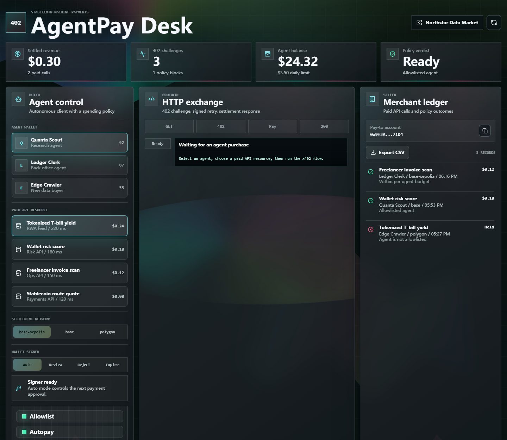
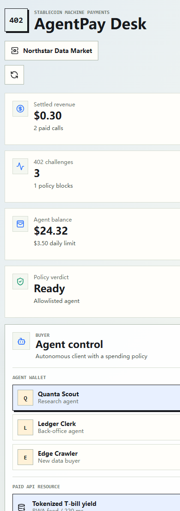
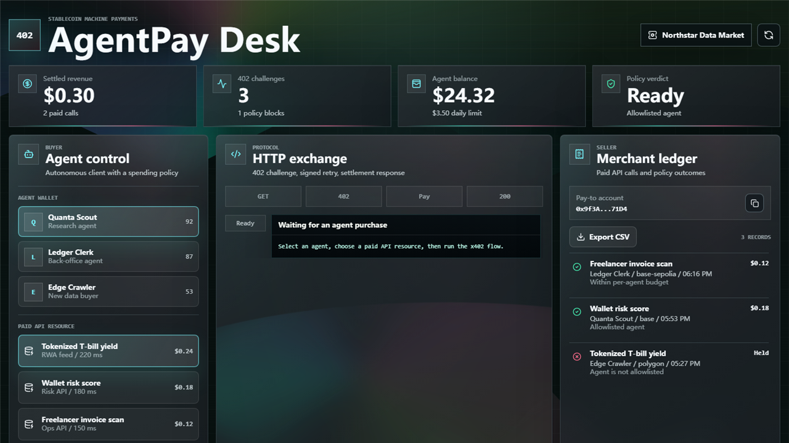

# AgentPay Desk

Stablecoin payment desk for AI agents buying paid API resources with an x402-style `402 Payment Required` challenge, wallet approval states, signed retry, merchant ledger, API keys, webhook reconciliation, risk controls, and a liquid-glass operations UI.

Live demo: https://agentpay-desk.vercel.app

[](https://github.com/yuhangxian235/agentpay-desk/actions/workflows/ci.yml)



## Why this exists

AI agents are starting to act like software buyers: they request data, consume APIs, and may need to pay small amounts without a human checkout flow. AgentPay Desk explores that product surface with a Web3 payment-infrastructure lens.

The demo models a paid HTTP API flow:

1. An agent requests a protected API resource.
2. The seller returns `402 Payment Required`.
3. The wallet signer approves, rejects, or expires the payment request.
4. The agent signs and retries with `X-PAYMENT` when approval succeeds.
5. The seller returns data and an `X-PAYMENT-RESPONSE`.
6. The merchant ledger records settlement, policy blocks, and signer blocks.
7. Merchant ops tracks API keys and webhook-style reconciliation events.

This version uses a local simulator instead of moving real USDC. That keeps the demo safe and easy to run while preserving the integration boundaries for a production x402 client, wallet signer, seller middleware, facilitator, and ledger service.

## Screenshots

| Desktop flow | Mobile layout |
| --- | --- |
|  |  |

## Demo walkthrough



- [90-second captioned walkthrough](docs/demo/agentpay-90s-walkthrough.mp4)
- [Spoken script and shot list](docs/demo/90-second-walkthrough.md)
- [Technical write-up: x402-style payments for AI agents](docs/agent-payment-technical-writeup.md)
- [Product-grade roadmap](docs/product-grade-roadmap.md)

## Features

- AI agent buyer selection with wallet balance, daily limit, trust score, and allowlist state.
- Paid API marketplace for RWA yield data, wallet risk scoring, invoice scanning, and stablecoin route quotes.
- x402-style HTTP exchange panel backed by a real `/api/protected-resource` route.
- Server/API flow with `402`, `X-402-Version`, `X-PAYMENT`, and `X-PAYMENT-RESPONSE`.
- x402 facilitator adapter that returns settlement receipts before paid data is released.
- Wallet signer mock with Auto, Review, Reject, and Expire approval states.
- Merchant ledger for settled and blocked API calls.
- Merchant ledger CSV export for lightweight accounting and reconciliation.
- Merchant API key registry with rotate-state simulation and per-resource scopes.
- Protected API route enforces `X-API-Key` before returning a payment challenge.
- Webhook-style reconciliation feed for delivered settlements and held payments.
- Server-side merchant operations API for ledger rows, API keys, reconciliation events, CSV export, and audit trail.
- Optional file-backed merchant ops repository for local durable storage.
- Risk controls for allowlisting, autopay, settlement network, and per-call spend caps.
- Unit-tested payment requirement creation, authorization payloads, facilitator receipts, signer approval states, policy blocks, merchant ops API, API key scope enforcement, reconciliation events, and settlement records.
- Liquid-glass responsive dashboard UI for desktop and mobile.

## Tech stack

- React
- TypeScript
- Vite
- Vitest
- Playwright
- Lucide React

## Run locally

```bash
npm install
npm run dev
```

Open:

```text
http://127.0.0.1:5173/
```

Optional local durable merchant state:

```powershell
$env:MERCHANT_OPS_STORE="file"
$env:MERCHANT_OPS_FILE=".agentpay/merchant-ops.json"
npm run dev
```

Without those variables, the app uses the in-memory demo repository so Vercel can run without external credentials.

Optional facilitator endpoint marker:

```powershell
$env:X402_FACILITATOR_URL="https://facilitator.example/settle"
npm run dev
```

The current adapter still settles locally for demo safety, but the paid API response will expose `http-ready` facilitator metadata so the replacement boundary is visible.

## Quality checks

```bash
npm run lint
npm test
npm run test:e2e
npm run test:smoke
npm run build
```

GitHub Actions runs the same checks on `main` pushes and pull requests.
The `Live Smoke` workflow can also be run manually and checks the production Vercel URL on a schedule.

## Demo script

1. Click `Run x402 purchase` with `Quanta Scout` selected.
2. Point out the first unauthenticated request to `/api/protected-resource`.
3. Show the real HTTP `402 Payment Required` response, `X-402-Version`, wallet approval, signed `X-PAYMENT` retry, and final `X-PAYMENT-RESPONSE`.
4. Switch Wallet signer to `Reject` or `Expire` and rerun to show that failed approval stops before funds can move.
5. Select `Edge Crawler` and run the flow again to show policy blocking for a non-allowlisted agent.
6. Lower the spend cap below the endpoint price to show per-call risk enforcement.
7. Show Merchant ops: API key scopes, key rotation, and webhook events for settled or held payments.
8. Click `Export CSV` to download the merchant ledger for reconciliation.

## Architecture

```text
src/
  App.tsx                  Dashboard, controls, protocol feed, merchant ledger
  App.css                  Liquid-glass payment-operations interface
  lib/protectedResourceApi.ts
                           Shared protected-resource API handler
  lib/x402Facilitator.ts   Facilitator adapter boundary and settlement receipt metadata
  lib/x402Simulator.ts     x402 challenge, signer approval, payment authorization, risk policy, API keys, reconciliation, ledger helpers
  lib/x402Simulator.test.ts
tests/
  e2e/payment-flow.spec.ts
                           Browser E2E coverage for payment and merchant ops flows
api/
  protected-resource.ts    Vercel serverless API route
  merchant-ops.ts          Vercel serverless merchant operations route
docs/
  agent-payment-technical-writeup.md
                           Product and technical write-up for the agent payment flow
  product-grade-roadmap.md Production-readiness boundary and next steps
  real-x402-upgrade.md     Notes for replacing the simulator with production wiring
  screenshots/             README screenshots
src/lib/
  merchantOpsApi.ts        Merchant ops API contract and validation
  merchantOpsStore.ts      In-memory and file-backed merchant ops repository adapters
```

## Production upgrade path

See [`docs/real-x402-upgrade.md`](docs/real-x402-upgrade.md) for the implementation boundary map.

High-level path:

1. Replace `src/lib/x402Facilitator.ts` with a real x402 facilitator client.
2. Replace `src/lib/x402Simulator.ts` with real seller middleware and buyer client wiring.
3. Protect paid API routes and return exact USDC payment requirements.
4. Wrap agent requests with an x402-aware client and wallet signer approval flow.
5. Replace the demo storage adapter with Postgres, Supabase, SQLite, or Neon for production persistence.

Relevant docs:

- [Coinbase CDP x402 docs](https://docs.cdp.coinbase.com/x402/welcome)
- [x402 protocol site](https://www.x402.org/)

## Deploy to Vercel

The project includes a small `vercel.json` for a Vite static deployment.

GitHub flow:

1. Push this repo to GitHub.
2. In Vercel, create a new project and import the GitHub repo.
3. Keep the default install command.
4. Use `npm run build` as the build command.
5. Use `dist` as the output directory.
6. Deploy.

CLI flow:

```bash
npm install -g vercel
vercel
vercel --prod
```

## Resume bullets

- Built an x402-style stablecoin payment desk for AI agents buying paid API resources.
- Implemented a real protected API route with 402 challenge handling, wallet signer approval states, signed payment retry validation, facilitator receipt handling, merchant ledger, API key rotation, webhook reconciliation, and risk-policy checks in React + TypeScript.
- Added unit and Playwright E2E tests for payment requirement creation, signer decisions, authorization payloads, protected API responses, facilitator receipts, API key scope enforcement, policy blocks, merchant ops API, API key rotation, CSV export, mobile layout, reconciliation events, audit trail, and settlement records.
- Designed a liquid-glass responsive dashboard for agent budgets, USDC-style payment authorization, failed signer approvals, paid payload delivery, merchant API keys, CSV export, and reconciliation events.
