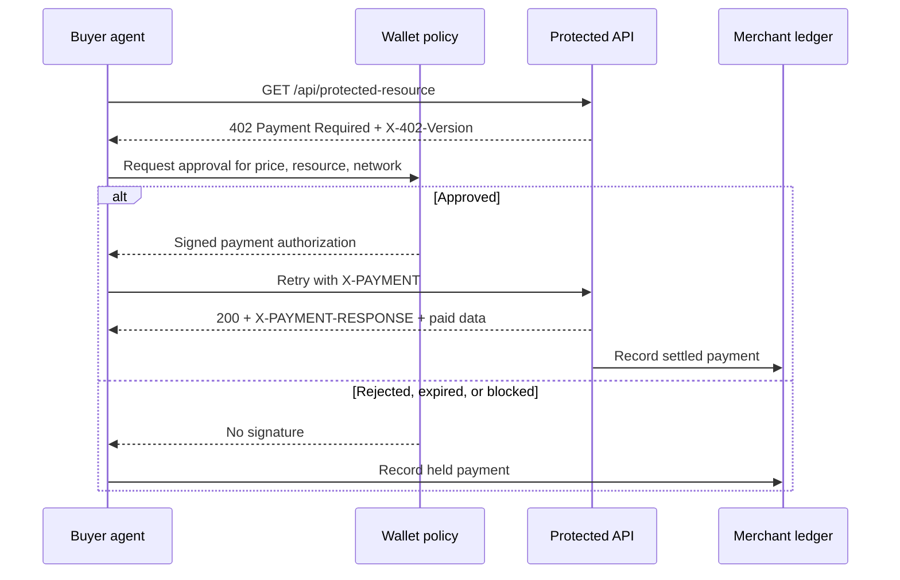

# Building AgentPay Desk: x402-Style Payments For AI Agents

AgentPay Desk is a product prototype for a near-future workflow: autonomous agents need to buy small API resources without stopping for a human checkout screen. The demo focuses on stablecoin API billing, but the more important idea is the interface between three systems:

- A buyer agent that wants data or computation.
- A seller API that can require payment over HTTP.
- A wallet and policy layer that decides whether the agent is allowed to pay.

The project is intentionally small enough to review quickly, but it preserves production-shaped boundaries: a protected API route, a merchant operations API route, a 402 challenge, signer approval states, signed retry, merchant ledger, API key rotation, webhook-style reconciliation, CSV export, audit trail, and browser E2E coverage.

Live demo: https://agentpay-desk.vercel.app

Code: https://github.com/yuhangxian235/agentpay-desk

## Why Agent Payments Need A Different Checkout

Human checkout flows assume a person can read a page, click a pay button, and wait for a receipt. Agent workflows are different:

1. The agent is already inside an HTTP request.
2. The seller needs a machine-readable way to say "this resource costs money".
3. The buyer needs a policy layer before funds move.
4. The retry should happen inside the same protocol flow.
5. The merchant still needs accounting, settlement traces, API keys, and reconciliation.

That is why an HTTP-native payment pattern is interesting. A server can return `402 Payment Required`, the client can sign a payment authorization, then retry with `X-PAYMENT`. The user experience becomes a payment operations console instead of a checkout page.

## Demo Flow



In the UI, the center panel shows this as a four-step protocol rail:

```text
GET -> 402 -> Pay -> 200
```

The important behavior is that rejected, expired, or policy-blocked payments stop before a signed `X-PAYMENT` header exists.

## Code Boundaries

### Seller API

The production-shaped seller route is:

```text
api/protected-resource.ts
src/lib/protectedResourceApi.ts
```

`api/protected-resource.ts` is the Vercel serverless entrypoint. It reads query params and the `x-payment` header, then calls `handleProtectedResource`.

`handleProtectedResource` does four things:

1. Validates the selected agent, resource, and network.
2. Verifies `X-API-Key` and endpoint scope before a payment challenge can be issued.
3. Returns `402` and `X-402-Version` when no payment header is present.
4. Decodes and checks `X-PAYMENT`, then returns paid data and `X-PAYMENT-RESPONSE`.

This keeps the API route real while still avoiding real funds in the demo.

### Payment Simulator

The simulator lives in:

```text
src/lib/x402Simulator.ts
```

It owns the demo domain model:

- `Agent`
- `ApiResource`
- `PaymentRequirement`
- `PaymentAuthorization`
- `LedgerEntry`
- `MerchantApiKey`
- `ReconciliationEvent`

The key functions are:

- `createChallenge`: builds an x402-style payment requirement.
- `createAuthorization`: creates a signed-looking `X-PAYMENT` payload.
- `verifyApiKey`: checks a demo API key and resource scope before payment.
- `evaluateRisk`: enforces allowlist, autopay, spend cap, daily budget, and wallet balance.
- `evaluateSigner`: models Auto, Review, Reject, and Expire wallet states.
- `createLedgerEntry`: records settled or blocked payments.
- `buildReconciliationEvents`: turns ledger rows into merchant-facing webhook events.
- `rotateApiKey`: simulates merchant key rotation.
- `ledgerToCsv`: exports reconciliation rows for accounting.

### Frontend Orchestration

The main interface is:

```text
src/App.tsx
```

The `runPurchase` function coordinates the payment flow:

1. Calls the protected API route without payment.
2. Displays the `402 Payment Required` challenge.
3. Runs local risk checks.
4. Runs the wallet signer state.
5. Creates `X-PAYMENT` only after approval.
6. Retries the protected API route with the signed authorization.
7. Posts the settlement or held-payment result to `/api/merchant-ops`.
8. Updates the paid payload, merchant ledger, reconciliation feed, and audit trail.

This makes the UI useful for demoing both success and failure paths.

## Merchant Operations Layer

Agent payments are not just a buyer problem. The merchant needs operational controls:

- API keys with endpoint scopes.
- Key rotation state.
- Settled and held payment records.
- Webhook-style reconciliation events.
- CSV export for accounting.
- Audit events for reset, ledger append, and key rotation.

That is why the right panel shows both `Merchant ledger` and `API keys & webhooks`. It helps the demo read like infrastructure, not only a toy client flow.

The merchant operations backend is:

```text
api/merchant-ops.ts
src/lib/merchantOpsApi.ts
src/lib/merchantOpsStore.ts
```

`/api/merchant-ops` supports:

- `GET /api/merchant-ops` for merchant state.
- `GET /api/merchant-ops?format=csv` for ledger export.
- `POST /api/merchant-ops` with `append-ledger`, `rotate-key`, or `reset` actions.

The repository now has two implementations: the default in-memory demo store and an optional file-backed JSON adapter for local durable storage. Set `MERCHANT_OPS_STORE=file` and optionally `MERCHANT_OPS_FILE=.agentpay/merchant-ops.json` to persist merchant state across local server restarts.

The important product-grade boundary is the repository interface: a durable Postgres, Supabase, SQLite, or Neon adapter can replace the demo adapters without changing the UI flow.

## API Key Enforcement

Paid API access now has two gates:

1. `X-API-Key` verifies that the client is allowed to reach a seller endpoint.
2. `X-PAYMENT` verifies that the client has paid for the specific response.

That means a missing or wrong API key returns `401` or `403` before the server even returns an x402 challenge. Only a scoped key can receive `402 Payment Required`.

The demo credentials are intentionally public and non-production:

```text
ak_live_7Qm9_demo -> rwa-yield, wallet-risk
ak_live_D4p2_demo -> invoice-scan
ak_test_5Vx1_demo -> fx-route
```

A production version should store hashed API key secrets, enforce merchant tenancy, rotate keys with grace periods, and audit denied calls.

## Risk Model

The demo risk policy is deliberately simple:

```text
allowlistedOnly
autopay
spendCapUsd
agent.dailyLimitUsd
agent.balanceUsd
```

The policy layer can block before the wallet signs. This is the key product idea: agents should not be able to spend just because an API returned a price. A production version would add velocity checks, merchant deny lists, endpoint risk tiers, wallet reputation, and manual approval thresholds.

## Test Coverage

The project has two levels of tests.

Unit tests cover payment requirement creation, authorization payloads, API key scope enforcement, risk policy, signer states, ledger rows, merchant ops API actions, API key rotation, file-backed repository persistence, reconciliation events, audit events, and CSV export.

Browser E2E tests cover:

- Auto signer success.
- Review signer success.
- Reject stops before `X-PAYMENT`.
- Expire stops before `X-PAYMENT`.
- API key rotation.
- CSV export.
- Merchant audit trail updates.
- Mobile layout without horizontal overflow.

The CI workflow runs linting, unit tests, production build, and Playwright E2E. A separate smoke script checks the deployed homepage, protected API route, merchant ops API, storage metadata, and ledger CSV export.

## What Is Simulated

The demo does not move real USDC. These pieces are simulated:

- Signature creation.
- Facilitator settlement.
- Production database persistence for ledger rows.
- Production database persistence for API keys.
- Webhook delivery.

The value of the project is that each simulated piece has a clear replacement boundary. A real implementation would replace the internals without needing to redesign the product flow.

## Production Upgrade Path

The next technical upgrades are:

1. Replace `createChallenge` and `handleProtectedResource` internals with real x402 seller middleware.
2. Replace `createAuthorization` with a real wallet signer or account-abstraction policy module.
3. Replace the demo adapters in `merchantOpsStore.ts` with a durable repository backed by Postgres, Supabase, SQLite, or Neon.
4. Add webhook verification and retry handling.
5. Store settlement references, payload hashes, invoice ids, and policy verdicts.

More detailed boundary notes are in [`real-x402-upgrade.md`](real-x402-upgrade.md).
Product readiness notes are in [`product-grade-roadmap.md`](product-grade-roadmap.md).

## What This Demonstrates

AgentPay Desk is not trying to be a complete payment processor. It demonstrates that I can take an emerging Web3 protocol surface and turn it into a product-shaped demo with:

- Real HTTP/API behavior.
- Clear protocol state transitions.
- A buyer-side policy and wallet model.
- Merchant-facing reconciliation.
- Server-side merchant ops boundary and audit trail.
- Tests and production deployment.
- A UI polished enough to explain the system quickly.

That combination is the skill I want to bring to stablecoin payment, agent payment, API billing, and Web3 developer-tool teams.
